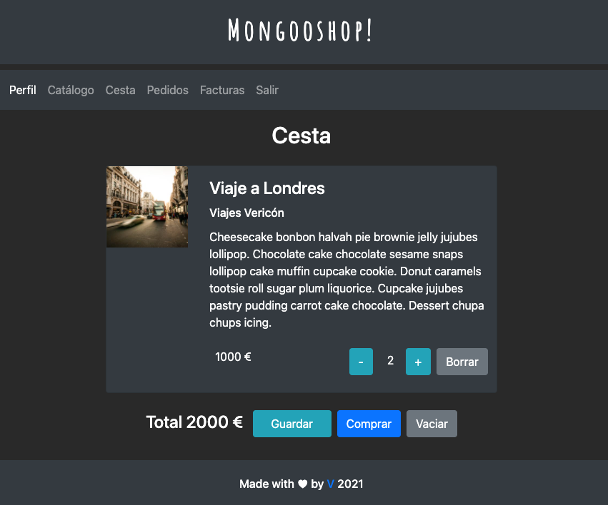

<div style="text-align:center">

# Mongooshop
Small project with login, register, user authentication and user modification based in Mongo Express Angular & Node.js WITH MONGOOSE
## Front server development
Run `ng serve` for a front dev server. Navigate to `http://localhost:4200/`.
## Back server development
in cd node
Run `nodemon aplicacion.js` for a back dev server. Navigate to `https://localhost:6001/`.

### Technologies
* 💫 Mongoose
* 🔥 Express
* 💣 Angular
* ✨ Node.js

### Funcionality
* Login
* Register
   * Observable - Configurable connection
   * Authentication
   * https
* User Authentication
* User Modification
* Catalog
* Cart

### Dependencies
* validatorjs
* nodemon
* mongodb
* express
* jsonwebtoken

#### Notes about mongoDB
If you installed mongoDB globally you'd have to link it using:
```shell
npm link mongodb
```
  1. Only connect mongodb at the beginning
  2. You get an object that represents the database
     - You ask for the scheme, it is an object that represents the scheme.
  3. You ask the scheme for the collection:
   - It is an object that represents the collection

#### restClient
Include calls to check endpoints
#### 2 backends
* Node
```shell
cd Node - nodemon aplicacion.js
```
* Node_Await
```shell
cd Node_Await - nodemon aplicacion.js
```

#### Cestas/pedidos
- Componer una esta (angular)
- guardar cestas
- listar cestas
   - los usuarios pueden hacer sus cestas
- borrar cestas
- seleccionar cestas
- "comprar" cesta
   - proceso en el que se emite factura, y se prepara un envio a partir de una cesta/pedido